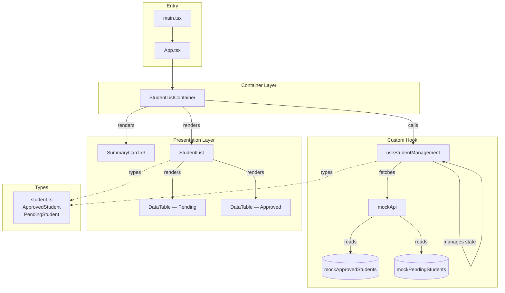
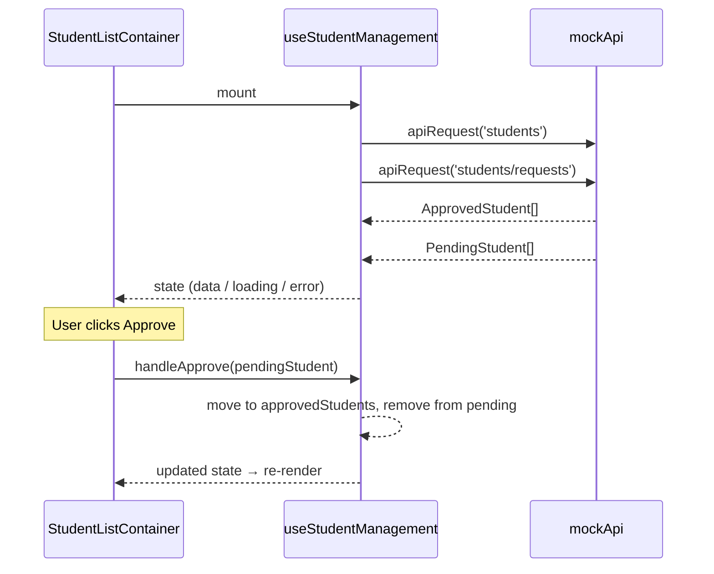

# Student Management App

A React + TypeScript frontend for managing student enrollment requests — approve or reject pending applications, and view the approved student list.

---

## Project Structure

```
test-pjt/
├── index.html
├── vite.config.ts
├── tsconfig.json
└── src/
    ├── main.tsx                          # App entry point
    ├── App.tsx                           # Root component
    ├── index.css
    │
    ├── types/
    │   └── student.ts                    # ApprovedStudent, PendingStudent interfaces
    │
    ├── api/
    │   ├── mockApi.ts                    # Simulated async API (students, students/requests)
    │   └── mockApi.test.ts
    │
    ├── data/
    │   ├── mockApprovedStudents.ts       # Seed data — approved
    │   ├── mockApprovedStudents.test.ts
    │   ├── mockPendingStudents.ts        # Seed data — pending
    │   └── mockPendingStudents.test.ts
    │
    ├── hooks/
    │   └── useStudentManagement.ts       # State + business logic (fetch, approve, reject)
    │
    ├── containers/
    │   ├── StudentListContainer.tsx      # Page-level composition layer
    │   ├── StudentListContainer.css
    │   └── StudentListContainer.test.tsx
    │
    ├── components/
    │   ├── StudentList.tsx               # Renders pending + approved sections
    │   ├── StudentList.css
    │   ├── StudentList.test.tsx
    │   ├── SummaryCard.tsx               # Clickable stat badge (Total / Approved / Pending)
    │   ├── SummaryCard.css
    │   ├── SummaryCard.test.tsx
    │   ├── DataTable.tsx                 # Generic sortable, filterable, paginated table
    │   ├── DataTable.css
    │   └── DataTable.test.tsx
    │
    └── test/
        └── setup.ts                      # Vitest + Testing Library global setup
```

---

## Architecture Diagram



---

## Data Flow



---

## Component Responsibilities

| Layer | File | Responsibility |
|-------|------|----------------|
| Hook | `useStudentManagement` | All state: fetch, approve, reject logic |
| Container | `StudentListContainer` | Layout composition, scroll navigation |
| Component | `StudentList` | Section layout, loading/error states |
| Component | `SummaryCard` | Stat display, optional scroll-to click |
| Component | `DataTable` | Generic table: sort, filter, paginate |
| API | `mockApi` | Simulated network with typed overloads |
| Types | `student.ts` | `ApprovedStudent`, `PendingStudent` shapes |

---

## Running the App

```bash
npm install
npm run dev
```

## Running Tests

```bash
npm test
```
